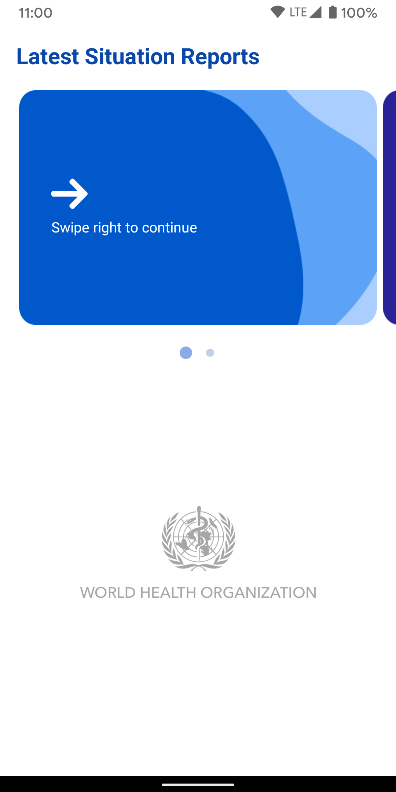
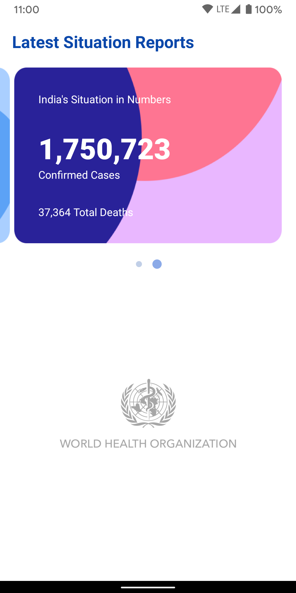

# Covid Dashboard App
This repository implements MVVM architecture using Dagger2, Retrofit2, ViewModel and LiveData.

## The app has following packages:
1. **ui**: It contains Views(Activities and Fragments).
2. **di**: Dependency providing classes using Dagger2.
3. **viewmodels**: Contains android ViewModels. They provide data to Views by interacting with repositories.
4. **utils**: Utility classes.
5. **models**: Kotlin data classes.
6. **networking**: Retrofit interface for accessing REST APIs endpoints.
7. **repositories**: Repositories to fetch data from data source(Remote data source).

## Screenshots:

  
  

### Note: This version doesn't support offline access.